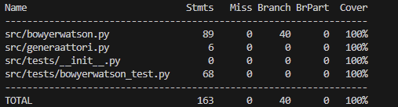

# kattavuusraportti

# Mitä on testattu
Yksikkötesteillä on testattu:
- Muodostuuko superkolmio oikein.
- Laskeeko funktio oikein kolmion ympäri piirretyn ympyrän keskipisteen.
- Palauttaako funktio "onko_piste_kehäympyrän_sisällä" oikein.
- Muodostaako BowyerWatson algoritmi oikean määrän kolmioita eri tilanteissa.
- Lasketaanko oikein radiaani monikulmion sisällä olevan pisteen ja ulkoreunan pisteen välille.
- Palauttaako Voronoi-diagrammin luova funktio oikean määrän kolmion kärkiä, joiden ympärille muodostetaan monikulmiot

# Testauksessa käytetyt syötteet
Yksikkötesteissä käytettyjä syötteitä:
- Superkolmio muodostettu pisteistä (1,1),(0,0),(2,2)
- Keskipisteen laskemisessa on käytetty pisteitä (0,0),(0,2),(2,0) ja testattu kolmella eri pisteellä, sijaitseeko annetut pisteet tämän kehäympyrän sisällä
- Delaunay triangulaatio muodostettu eri pistekoordinaateilla (neljällä pisteellä, kolmella pisteellä jotka ovat suorassa linjassa, kahdella pisteellä sekä kymmenellä pisteellä, joista 6 reunalla ja 4 sisäpuolella).
- Palauttaako satunnaisten pisteiden tuottava funktio oikean määrän pisteitä, kun n=25
- Lasketaanko oikea radiaani, kun keskipiste (0,0) ja ulkopiste (0,1) tai (-1,0)
- Palauttaako Voronoi-diagrammin luova funktio kolme kärkeä, kun yksi kolmio sekä viisi kärkeä, kun kaksi kolmiota (yksi yhteinen piste).
