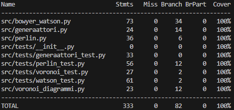

# kattavuusraportti

# Mitä on testattu
Yksikkötesteillä on testattu:
- Muodostuuko superkolmio oikein.
- Laskeeko funktio oikein kolmion ympäri piirretyn ympyrän keskipisteen.
- Palauttaako funktio "onko_piste_kehäympyrän_sisällä" oikein.
- Muodostaako BowyerWatson algoritmi oikean määrän kolmioita eri tilanteissa.
- Lasketaanko oikein radiaani monikulmion sisällä olevan pisteen ja ulkoreunan pisteen välille.
- Ohitetaanko sellaiseen keskipisteen laskenta, joka jaetaan nollalla.
- Jätetäänkö superkolmion kärjet pois triangulaatiosta
- Palauttaako Voronoi-diagrammin luova funktio oikean määrän kolmion kärkiä, joiden ympärille muodostetaan monikulmiot.
- Muodostaako Voronoi-diagrammin luova funktio monikulmioita, jos kolmiot ovat virheellisiä.
- Toimiiko Perlin-kohinan sulautusfunktio.
- Toimiiko Perlin-kohinan lineaarinen interpolointi.
- Muodostuuko Perlin-kohinan gradienttivektorit oikein.
- Tuottaako Perlin-kohina algoritmi jokaiselle satunnaiselle pisteen arvon väliltä [-sqrt(N)/4, sqrt(N)/4]. 
- Onko Perlin-kohina jatkuvaa.
- Kohinan jakauma ja sen arvot.
- Kohinan sileys.
- Kohinan solmukohdat.

# Testauksessa käytetyt syötteet
Yksikkötesteissä käytettyjä syötteitä:
- Superkolmio muodostettu pisteistä (1,1),(0,0),(2,2).
- Keskipisteen laskemisessa on käytetty pisteitä (0,0),(0,2),(2,0) ja testattu kolmella eri pisteellä, sijaitseeko annetut pisteet tämän kehäympyrän sisällä.
- Keskipiste jätetty laskematta, kun pisteet (0,0) (1,1), (2,2)
- Delaunay triangulaatio muodostettu eri pistekoordinaateilla (neljällä pisteellä, kolmella pisteellä jotka ovat suorassa linjassa, kuudella pisteellä, kahdella pisteellä sekä kymmenellä pisteellä, joista 6 reunalla ja 4 sisäpuolella).
- Palauttaako satunnaisten pisteiden tuottava funktio oikean määrän pisteitä, kun n=25.
- Lasketaanko oikea radiaani, kun keskipiste (0,0) ja ulkopiste (0,1) tai (-1,0).
- Palauttaako Voronoi-diagrammin luova funktio kolme kärkeä, kun yksi kolmio, sekä viisi kärkeä, kun kaksi kolmiota (yksi yhteinen piste).
- Palauttaako Voronoi-diagrammin luova funktio 0 monikulmion kärkeä, kun annetaan kaksi virheellistä kolmiota.
- sulautusfunktiota testattu arvoilla t(0) ja t(1).
- lineaarinen interpolaatio arvoilla lerp(5,12,7).
- Gradienttivektorit, kun h=0, h=1, h=2 ja h=3.
- Kohina ja sen ominaisuudet tuhannella satunnaisella pisteellä.
